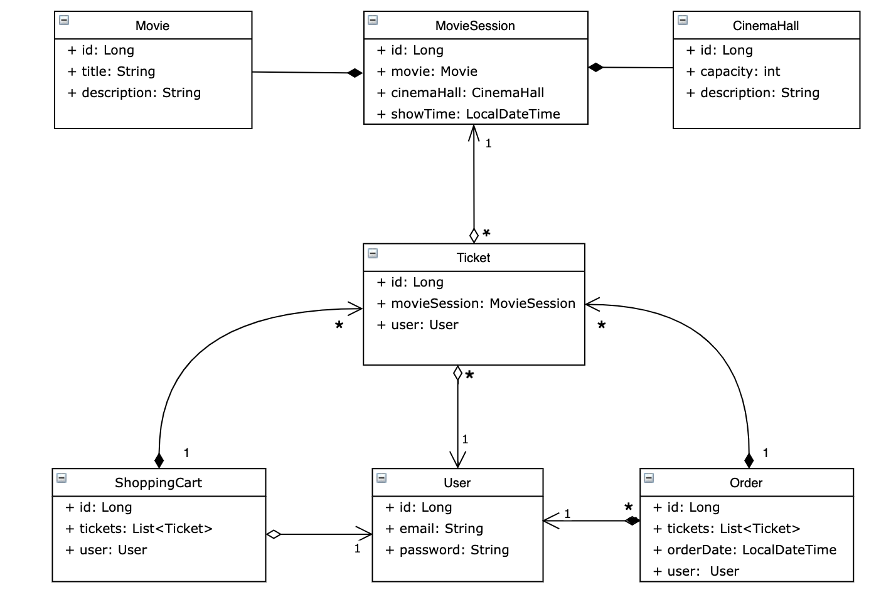

# Cinema-app 
This project simulates the work of a cinema.

With this application, users can register in their personal account, order tickets, view the movie schedule, and receive information about movies. The functionality of roles is also implemented. The user can be either an ADMIN or a USER. 

The program is based on a 3-tier architecture:
- DAO (Data access layer)
- Service (Application layer)
- Controller (Presentation layer)

# What is the feature set of this service? 
- To use the application, the user must be logged in. 
- Anyone can register. 
- The user can receive information about movies, the admin can also add new movies. 
- The user can receive information about the cinema halls, the admin can also add new cinema halls. 
- The user can receive information about movie sessions, the admin can also add, update and delete movie sessions.
- The user can add a movie to their shopping cart. 
- The user can complete their order and also get the history of their own orders.  
# How to run? 
- Clone a repository with GitHub
- Create an empty database
- In the db.properties file, replace the values of the properties `YOUR_DRIVER`, `YOUR_DATABASE_URL`, `YOUR_ROOT` and `YOUR_PASSWORD` with the appropriate values for your database setup
- Build the project with Maven: mvn clean install
- Deploy the generated WAR file to a servlet container, such as Tomcat

# How does the structure work? 

- `dao`: interfaces and their implementations are responsible for connection with the database and performing CRUD operations.
- `service`: interfaces and their implementations are responsible for the business logic of the application.
- `controllers:`
  -  Authentication - POST: `/register` (you can register, ALL)
  -  CinemaHall:
     - POST: `/cinema-halls` (add new cinema hall, role: ADMIN)
     - GET: `/cinema-halls` (display all the cinema halls, role: ADMIN, USER)
  - Movie:
     - POST: `/movies` (add new movie, role: ADMIN)
     - GET: `/movies` (display all the movies, role: ADMIN, USER)
  - MovieSession:
     - POST: `/movie-sessions` (add new movie session, role: ADMIN)
     - PUT: `/movie-sessions/{id}` (update movie session with specified id, role: ADMIN)
     - DELETE: `/movie-sessions/{id}` (delete movie session by id, role: ADMIN)
     - GET: `/movie-sessions/available` (display all the available movie sessions, role: ADMIN, USER)
  - Order:
     - GET: `/orders` (display all the orders, role: USER)
     - POST: `/orders/complete` (complete the current order, role: USER)
  - ShoppingCart:
     - GET: `/shopping-carts/by-user` (display the contents of the current user's shopping, role: USER)
     - PUT: `/shopping-carts/movie-sessions` (add movie session to the shopping cart, role: USER)
  - User - GET: `/users/by-email` (find user by email, role: ADMIN)
- `model`: stores information about entities and their properties.
- `dto`: to transfer data between different layers or components of an application.
- `security`: defines access rights to user according to user's role.
- `resources`: configuration file.

# How does the project structure look like? 

# Used Technologies 

- Java `17.0.6`
- MySQL `8.0.22`
- Hibernate ORM `5.6.14.Final`
- Spring Framework `5.3.20`
- Spring Security `5.6.10`
- Apache Tomcat `9.0.7`
- Maven `3.8.7`
- Maven Checkstyle Plugin `3.1.1`

# Author 
<a href="https://github.com/PlagueEbola">Sushko Roman</a>
